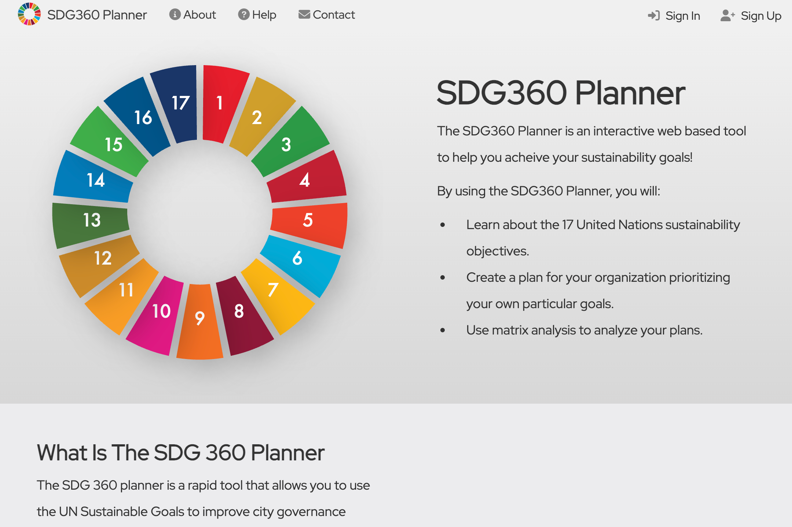

	

		
	

# SDG360 Planner

SDG360 Planner is an interactive web based tool for designing sustainability plans using the SDG360 methodology.

    
    
<i>SDG360 Planner</i>

<!-- LICENSE -->
## License

Distributed under the permissive MIT license. See the [license](./LICENSE.txt) for more information.

<!-- Acknowledgements -->
## Acknowledgements

This software was created by the [American Family Insurance Data Science Institute](https://datascience.wisc.edu/) at the [University of Wisconsin-Madison](https://www.wisc.edu/) under a grant from [IRIS Hep](https://iris-hep.org/)